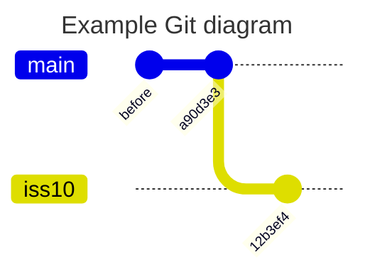
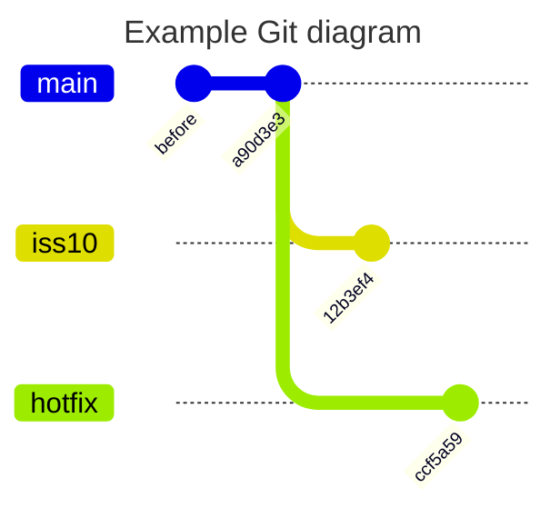
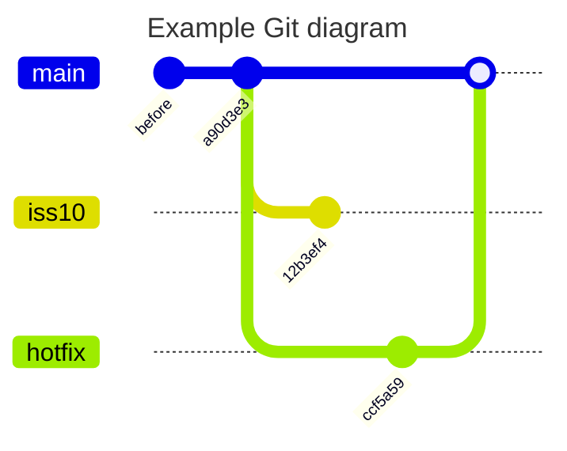
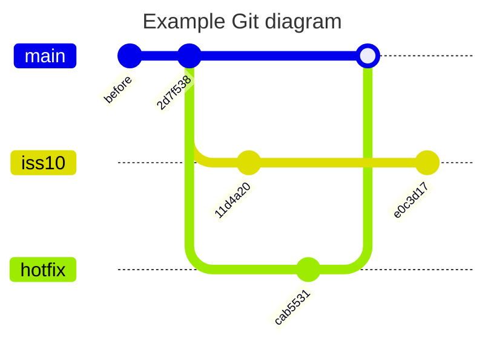
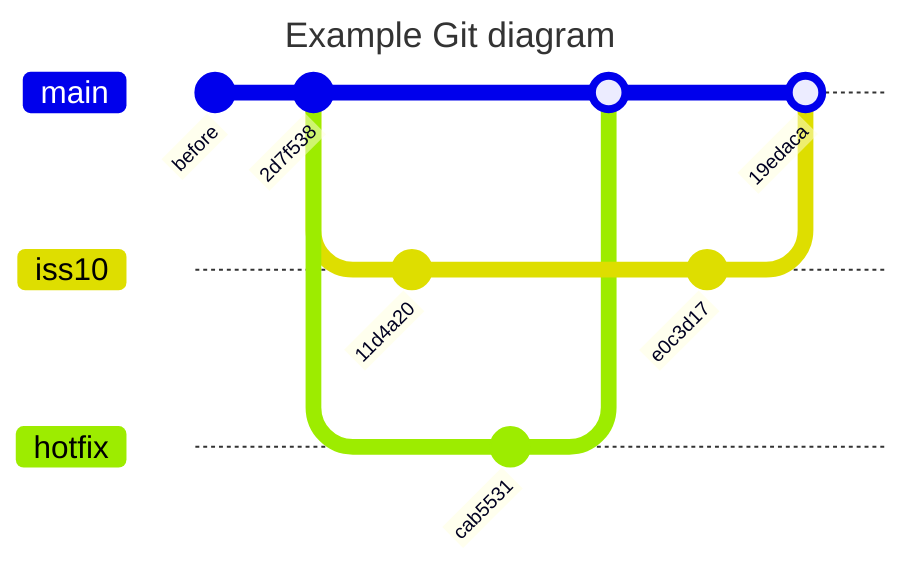

# < Git Flow Branch 전략 >


# 1. Git FLow 개요

git flow 란?

* 2010년 Vincent Driessen 가 자신의 블로그에 올린 글을 시작으로 널리 퍼지기 시작한 git branch 관리 방법
* 기술이라기 보다는 협업하는 사람들끼리 브랜치 관리에 대해 "우리 이렇게 브랜치 전략 짜자" 와 같은 방법론(Model)일 뿐임.
* git 을 활용한 방법이므로 git 명령들에 대한 사전 지식이 필요함. 


# 2. git 명령들


## 1) git 사용 수준의 3단계

* 1단계 : git clone이후 main 브렌치에서 커밋과 푸시만 하는 경우

* 2단계 : 브랜치간 merge를 사용할 수 있고, switch와 restore 를 이용해 롤백을 사용

* 3단계 : 둘 이상의 원격 저장소를 활용하여 소스 코드를 관리하고 협업


## 2) git 기본 명령

간단한 실습을 통해서 init / commit / switch / merge  등의 기본 명령을 알아자.


### git init

```sh

$ mkdir -p ~/temp/gittest
  cd ~/temp/gittest

$ git config --global user.email "ssongmantop@gmail.com"
  git config --global user.name "root"
  git config --global init.defaultBranch main


$ git init
Initialized empty Git repository in /home/ktdseduuser/temp/gittest/.git/

```


### userlist 초기 Data file 생성

실습에 이용할 userlist 라는 파일을 생성하자.

```sh

# userlist 초기 Data file 생성
$ cat <<EOF > userlist
1: Song
2: Lee
3: Kim
EOF


$ git status
On branch main

No commits yet

Untracked files:
  (use "git add <file>..." to include in what will be committed)
        userlist

nothing added to commit but untracked files present (use "git add" to track)


# untracked file 은 git stage 가지 않은 파일이다.
# 이 상태에서 브랜치 변경이 안된다.


# add
$ git add .

$ git status
On branch main

No commits yet

Changes to be committed:
  (use "git rm --cached <file>..." to unstage)
        new file:   userlist


# commit
$ git commit -a -m "create userlist file"
[main (root-commit) a90d3e3] create userlist file

$ git status
On branch main
nothing to commit, working tree clean


# commit log 확인
$ git log
commit a90d3e357b64750a0394c7db35453e505bc33036 (HEAD -> main)
Author: root <ssongmantop@gmail.com>
Date:   Sun Sep 24 04:50:10 2023 +0000

    create userlist file

```

현재 1개의 commit 이 존재하는 상태이다


### iss10 브랜치 

이때 userlist 에 새로운 user를 추가(Park1, Park2)해야 하는 이슈(issue 10번)가 등록 되었다고 가정하자.

이 이슈에 집중할 수 있는 브랜치를 새롭게 하나 만들고 switch 까지 수행한다.

```sh

$ git switch -c iss10
Switched to a new branch 'iss10'

# 위 명령은 아래 명령을 줄여 놓은 것이다.
# git branch iss10  / git switch iss10

```

[참고] git checkout 이 switch 로 변경됨

* git checkout 명령에서 switch 명령으로 변경
* Git 2.23에서 checkout을 대신할 switch, restore가 도입되었다.
* checkout 을 사용해도 작동은 되지만
* git --help에도 checkout 명령어가 나오지 않는다.


```sh

# userlist 에 새로운 user 중 Park1 이 추가됨
$ echo "4: Park1" >> userlist

$ cat userlist
1: Song
2: Lee
3: Kim
4: Park1


$ git status
On branch iss10
Changes not staged for commit:
  (use "git add <file>..." to update what will be committed)
  (use "git restore <file>..." to discard changes in working directory)
        modified:   userlist

no changes added to commit (use "git add" and/or "git commit -a")

```


다른 상황을 가정해 보자.  

main 사이트에 문제가 생겨서 다시 main 브랜치로 돌아가서 작업해야 한다.

아직 커밋하지 않은 파일이 존재한 상태에서 checkout 시도할 경우 충돌 발생하여시 브랜치 변경이 안된다.

그러므로 작업중인 워킹 디렉토리는 커밋으로 정리해 주는 것이 좋다.

물론 stash/cleaning 과 같은 작업으로 처리하는 방법이 있다.


현재까지 작업하던것을 모두 커밋하고 main 으로 변경하자.

```sh

# add & commit
$ git commit -a -m "userlist Park1 추가됨"
[iss10 12b3ef4] userlist Park1 추가됨


$ git status
On branch iss10
nothing to commit, working tree clean


$ git log
commit 12b3ef437d93b3c30703bb3ad2781dea7abeadb9 (HEAD -> iss10)
Author: root <ssongmantop@gmail.com>
Date:   Sun Sep 24 04:52:02 2023 +0000

    userlist Park1 추가됨

commit a90d3e357b64750a0394c7db35453e505bc33036 (main)
Author: root <ssongmantop@gmail.com>
Date:   Sun Sep 24 04:50:10 2023 +0000

    create userlist file

# main 브랜치로 변경
$ git switch main

```





### hotfix 브랜치

문제가 생긴 내용을 확인해 보니 userlist 내에 Choi user 를 긴급히 추가해야 하는 상황이다.

이 문제를 해결하기 위해 hotfix 브랜치를 새롭게 만들어서 사용한다.

```sh

$ git switch -c hotfix

$ cat userlist
1: Song
2: Lee
3: Kim

# Main 브랜치에 있는 userlisit 는 iss10 과는 무관한 파일이다.

# userlist Choi 추가
$ echo "4: Choi" >> userlist

$ cat userlist
1: Song
2: Lee
3: Kim
4: Choi


# add & commit
$ git commit -a -m "userlist Choi 추가"
[hotfix ccf5a59] userlist Choi 추가


$ git log
commit ccf5a5916e90c08d3370c74a1ab60e19bee458e1 (HEAD -> hotfix)
Author: root <ssongmantop@gmail.com>
Date:   Sun Sep 24 04:54:55 2023 +0000

    userlist Choi 추가

commit a90d3e357b64750a0394c7db35453e505bc33036 (main)
Author: root <ssongmantop@gmail.com>
Date:   Sun Sep 24 04:50:10 2023 +0000

    create userlist file

```





### hotfix merge

hotfix 작업이 완료되면 운영환경에 배포하기 위해 main 브랜치에 합쳐야 한다.

```sh
$ git switch main

$ git merge hotfix -m "merge hotfix"
Updating a90d3e3..ccf5a59
Fast-forward (no commit created; -m option ignored)
 userlist | 1 +
 1 file changed, 1 insertion(+)

```




merge 에 따른 별도 커밋이 발생되지 않았고 main 의 위치만 최신 커밋으로 이동된 상태이다.

커밋이 발생하지 않았으므로 message 도 무시된다.

이런 merge 방식을 Fast forward 라고 부른다.


실제 commit 이력을 살펴보면 추가된 내역이 없음을 알 수 있다.

```sh

$ git log
commit ccf5a5916e90c08d3370c74a1ab60e19bee458e1 (HEAD -> main, hotfix)
Author: root <ssongmantop@gmail.com>
Date:   Sun Sep 24 04:54:55 2023 +0000

    userlist Choi 추가

commit a90d3e357b64750a0394c7db35453e505bc33036
Author: root <ssongmantop@gmail.com>
Date:   Sun Sep 24 04:50:10 2023 +0000

    create userlist file


```


hotfix는 더 이상 불필요하므로 삭제한다.

```sh
$ git branch -d hotfix

```


### iss10 작업수행

이제 iss10 으로 돌아가서 하던일을 계속 수행한다.

```sh
$ git switch iss10


# 이전에 수행했던 작업은  userlist 파일에 Park1 를 추가했었다.
$ cat userlist
1: Song
2: Lee
3: Kim
4: Park1


# 이번에는 Park2 를 추가하는 작업을 수행한다.
$ echo "5: Park2" >> userlist

$  cat userlist
1: Song
2: Lee
3: Kim
4: Park1
5: Park2


# commit
$ git commit -a -m "userlist Park2 추가됨"
[iss10 e0c3d17] userlist Park2 추가됨


```

userlist 파일 내용을 확인해보면 Par1, Park2 가 추가 되었다.

그리고 hotfix 로 수행했던 작업(4: Choi)이 영향을 끼치지 않았다는 점이 중요하다.





### iss10 merge

작업이 모두 완료되었으므로 main에서 merge 해 보자.


```sh
$ git switch main

# userlist 확인
$ cat userlist
1: Song
2: Lee
3: Kim
4: Choi

# userlist 에는 hotfix 에서 추가된 내용으로 유지되고 있다.


# merge 수행
$ git merge iss10 -m "merge iss10"
Auto-merging userlist
CONFLICT (content): Merge conflict in userlist
Automatic merge failed; fix conflicts and then commit the result.


# conflict 발생했다.


$ git log
commit ccf5a5916e90c08d3370c74a1ab60e19bee458e1 (HEAD -> main)
Author: root <ssongmantop@gmail.com>
Date:   Sun Sep 24 04:54:55 2023 +0000

    userlist Choi 추가

commit a90d3e357b64750a0394c7db35453e505bc33036
Author: root <ssongmantop@gmail.com>
Date:   Sun Sep 24 04:50:10 2023 +0000

    create userlist file

# conflict 발생으로 mergecommit 도 발생하지 않았다.
```

변경사항의 충돌을 개발자가 해결해야 한다.


```sh
$ git status
On branch main
You have unmerged paths.
  (fix conflicts and run "git commit")
  (use "git merge --abort" to abort the merge)

Unmerged paths:
  (use "git add <file>..." to mark resolution)
        both modified:   userlist

no changes added to commit (use "git add" and/or "git commit -a")

```

충돌 발생한 파일은 Unmerged paths 에서 확인할 수 있다.


### conflic 해결

충돌이 발생한 userlist 파일을 살펴보자.

```sh

$ cat userlist
1: Song
2: Lee
3: Kim
<<<<<<< HEAD
4: Choi
=======
4: Park1
5: Park2
>>>>>>> iss10

```

"=======" 중심으로 윗부분은 현재 브랜치에서의 내용이고 아랫부분은 iss10 브랜치 내용이다.

충돌을 해결하려면 둘중 하나를 고르거나 새로 작성하여 merge 해야 한다.

새롭게 작성해보자.


```sh

$ cat <<EOF > userlist
1: Song
2: Lee
3: Kim
4: Choi
5: Park2
EOF


$ git add .

$ git status
On branch main
All conflicts fixed but you are still merging.
  (use "git commit" to conclude merge)

Changes to be committed:
        modified:   userlist


```

git commit 명령으로 merge 한것을 커밋한다.


```sh
$ git commit -m "merge from iss10"
[main 19edaca] merge from iss10

$ git log -2
commit 19edacab32082a6119677555eddbd41a1f754941 (HEAD -> main)
Merge: ccf5a59 e0c3d17
Author: root <ssongmantop@gmail.com>
Date:   Sun Sep 24 05:08:22 2023 +0000

    merge from iss10

commit e0c3d1765897c415e057b41ba91eb4c4081bbd4a (iss10)
Author: root <ssongmantop@gmail.com>
Date:   Sun Sep 24 05:00:25 2023 +0000

    userlist Park2 추가됨

```





### 마무리


```sh

# 불필요한 브랜치 삭제
$ git branch -d iss10


# log 확인
$ git log -p -2
commit 19edacab32082a6119677555eddbd41a1f754941 (HEAD -> main)
Merge: ccf5a59 e0c3d17
Author: root <ssongmantop@gmail.com>
Date:   Sun Sep 24 05:08:22 2023 +0000

    merge from iss10

commit e0c3d1765897c415e057b41ba91eb4c4081bbd4a (iss10)
Author: root <ssongmantop@gmail.com>
Date:   Sun Sep 24 05:00:25 2023 +0000

    userlist Park2 추가됨

diff --git a/userlist b/userlist
index 819cb6b..080ec5c 100644
--- a/userlist
+++ b/userlist
@@ -2,3 +2,4 @@
 2: Lee
 3: Kim
 4: Park1
+5: Park2

```


## 3) git 고급 명령

아래는 알아두면 유용한 git 명령들이다.


### git clean

untracked 상태인 파일을 모두 삭제한다.

신규 파일을 생성후 이를 원복하고자 할때 사용된다.

```sh
$ cd ~/temp/gittest


# 신규 파일 생성
$ echo "some1" > some.txt
  mkdir somedir
  echo "some2" > somedir/some.txt


$ git status
On branch master
Untracked files:
  (use "git add <file>..." to include in what will be committed)
        somedir/

nothing added to commit but untracked files present (use "git add" to track)


# untracked file 모두 삭제
$ git clean -f -d


$ git status
On branch master
nothing to commit, working tree clean

```


### git restore

작업중인 파일을 기존 마지막 커밋의 상태로 되돌리고자 할때 사용한다.

```sh
$ cd ~/temp/gittest


$ cat userlist
1: Song
2: Lee
3: Kim
4: Choi
5: Park2


$ echo "6: temp song" >> userlist

$ git status
On branch main
Changes not staged for commit:
  (use "git add <file>..." to update what will be committed)
  (use "git restore <file>..." to discard changes in working directory)
        modified:   userlist

no changes added to commit (use "git add" and/or "git commit -a")


# 확인
$ cat userlist
1: Song
2: Lee
3: Kim
4: Choi
5: Park2
6: temp song

# 복원
$ git restore userlist

# 확인
$ cat userlist
1: Song
2: Lee
3: Kim
4: Choi
5: Park2

```


stage에 올라간 파일을 복원하는 경우

```sh

$ echo "6: temp song" >> userlist

$ git add .

$ git status
On branch main
Changes to be committed:
  (use "git restore --staged <file>..." to unstage)
        modified:   userlist


# 1) staged 복원
$ git restore --staged userlist

$ git status
On branch main
Changes not staged for commit:
  (use "git add <file>..." to update what will be committed)
  (use "git restore <file>..." to discard changes in working directory)
        modified:   userlist

no changes added to commit (use "git add" and/or "git commit -a")


$ cat userlist
1: Song
2: Lee
3: Kim
4: Choi
5: Park2
6: temp song


# 2) 일반 복원
$ git restore userlist
# git restore *


$ git status
On branch main
nothing to commit, working tree clean


$ cat userlist
1: Song
2: Lee
3: Kim
4: Choi
5: Park2

```


### git hard reset

git reset 명령은 공통적으로 커밋을 되돌릴 때 사용한다.

```sh
$ cd ~/song/gittest


# userlist 수정 및 commit

$ echo "6: Park3" >> userlist

$ cat userlist
1: Song
2: Lee
3: Kim
4: Choi
5: Park2
6: Park3

$ git add .
$ git commit -m "Park3 added"
[reset-test fe393bc] Park3 added
 1 file changed, 1 insertion(+)

$ git log --oneline
1b7e980 (HEAD -> main) Park3 added
ec24e4e create userlist file


# 1) 특정 commit 주소로 되돌리기
$ git reset --hard 8d879c5
HEAD is now at cf9f83f init update

# 확인
$ cat userlist
1: Song
2: Lee
3: Kim
4: Choi
5: Park2


$ git log --oneline -n1
cf9f83f (HEAD -> reset-test, main) init update


# [참고] 이전 커밋 형상으로 reset
$ git reset --hard HEAD~
HEAD is now at 42b5bd8 update


```


### git stash

파일의 변경 내용을 일시적으로 기록해 두는 영역이다.

git 을 사용하다 보면 생각보다 많이 사용하게 된다.

아직 commit 전 작업 수행중 다른 급한일을 처리하기 위해 브랜치를 이동해야 할때 git stash 를 사용한다.

이후 우선순위가 높은 작업을 모두처리후 다시 git stash 로 저장한 내용들을 불러와 작업을 이어 갈 수 있다.


```sh

# stash 로 저장
$ git switch -c stash-test

$ cat userlist
1: Song
2: Lee
3: Kim
4: Choi
5: Park2

$ echo "Park3" >> userlist

$ cat userlist
1: Song
2: Lee
3: Kim
4: Choi
5: Park2
Park3


# stash 로 저장
$ git stash
Saved working directory and index state WIP on stash-test: cf9f83f init update


$ cat userlist
1: Song
2: Lee
3: Kim
4: Choi
5: Park2


$ git status
On branch stash-test
nothing to commit, working tree clean


# 다른 작업 수행
$ git switch main
...

# Stash 원복
$ git switch stash-test


# stash 목록조회
$ git stash list
stash@{0}: WIP on stash-test: cf9f83f init update


# stash 불러오기
$ git stash pop
On branch stash-test
Changes not staged for commit:
  (use "git add <file>..." to update what will be committed)
  (use "git restore <file>..." to discard changes in working directory)
        modified:   userlist

no changes added to commit (use "git add" and/or "git commit -a")
Dropped refs/stash@{0} (823db603684dd002f7dda5a1649b79aeb177d7d0)


$ cat userlist
1: Song
2: Lee
3: Kim
4: Choi
5: Park2
Park3

# stash 하기전 상태로 원복되었다.
$ git status
On branch stash-test
Changes not staged for commit:
  (use "git add <file>..." to update what will be committed)
  (use "git restore <file>..." to discard changes in working directory)
        modified:   userlist

no changes added to commit (use "git add" and/or "git commit -a")


$ git clean 

```


[참고] pop 하기전에 list 를 모두 삭제할 수 있다.

```sh

# stash 목록조회
$ git stash list
stash@{0}: WIP on stash-test: cf9f83f init update

# stash 제거하기
$ git stash clear
```


### git merge theirs/ours 옵션 사용

충돌 해결 자체는 어렵고 내가 의도한 데로 되지 않는 경우가 많다.

merge -X 옵션과 ours , theirs 옵션을 사용하는방법으로 조금 더 간단히 해결할  수 있다.

아주 Smart 한 방법은 아니지만 그래도 상당히 쉽게 충돌 상황을 처리할 수 있다.

ours 나  theirs 옵션을 사용하면 출동 발생시 두 저장소 중 한 저장소의 것을 선택하도록 한다.


```sh
$ cd ~/temp/gittest

# 1) main 
$ git switch main

# userlist 초기 Data file 생성
$ cat <<EOF > userlist
1: Song
2: Lee
3: Kim
EOF

$ git add .
  git commit -a -m "init update"
[main (root-commit) ba23ed2] init update


# 2) feature 브랜치
$ git switch -c feature

# Park 추가
$ echo "4: Park" >> userlist

$ git commit -a -m "Park update"
[feature ecfa775] Park update

$ git log --oneline
ecfa775 (HEAD -> feature) Park update
ba23ed2 init update


# 3) main 브랜치
$ git switch main

$ cat userlist
1: Song
2: Lee
3: Kim


# userlist 초기 Data file 생성
$ echo "4: Choi" >> userlist


$ git commit -a -m "Choi update"
[main 286aaa3] Choi update


$ git log --oneline
286aaa3 (HEAD -> main) Choi update
ba23ed2 init update


# 4) merge
$ git switch main
$ git diff feature main
diff --git a/userlist b/userlist
index 6289400..e54b4eb 100644
--- a/userlist
+++ b/userlist
@@ -1,4 +1,4 @@
 1: Song
 2: Lee
 3: Kim
-4: Park
+4: Choi


$ git merge feature
Auto-merging userlist
CONFLICT (content): Merge conflict in userlist
Automatic merge failed; fix conflicts and then commit the result.

$ cat userlist
1: Song
2: Lee
3: Kim
<<<<<<< HEAD
4: Choi
=======
4: Park
>>>>>>> feature


# 5) merge 취소
$ git merge --abort
# merging 작업중에만 취소가 가능함


# 6) merge theirs
$ git merge feature -X theirs -m "merge theirs"
Auto-merging userlist
Merge made by the 'ort' strategy.
 userlist | 2 +-
 1 file changed, 1 insertion(+), 1 deletion(-)


$ cat userlist
1: Song
2: Lee
3: Kim
4: Park


# 7) merge 이전 커밋으로 되돌리기
$ git reset --hard HEAD~
HEAD is now at 53bf243 Choi update


$ git log --oneline -2
53bf243 (HEAD -> main) Choi update
76066e9 init update


# 8) merge ours
$ git merge feature -X ours -m "merge ours"
$ cat userlist
1: Song
2: Lee
3: Kim
4: Choi


```


## 4) Clean up

```sh

$ cd ~/temp/gittest


# git test 작업을 모두 삭제시
$ rm -rf *
  rm -rf .git

```


## 5) [참고] git prompt 생성

리눅스에서 git prompt 를 보기 위해서는 아래와 같은 작업이 필요하다.

```sh
$ vi ~/.bashrc
...
parse_git_branch() {
     git branch 2> /dev/null | sed -e '/^[^*]/d' -e 's/* \(.*\)/(\1)/'
}
export PS1="\e[01;32m\u@\h \[\e[34m\]\w\[\e[91m\]\$(parse_git_branch)\[\e[00m\]$ "


$ source ~/.bashrc

```


# 3. Git Flow Branch 전략


## 1) git flow 브랜치와 그 의미

git flow 에 존재하는 각각의 브랜치와 의미에 대해 알아보자.


Git-flow에는 5가지 종류의 브랜치가 존재한다.

 항상 유지되는 메인 브랜치들(master, develop)과 일정 기간 동안만 유지되는 보조 브랜치들(feature, release, hotfix)이 있다.


- master : 제품으로 출시될 수 있는 브랜치
- develop : 다음 출시 버전을 개발하는 브랜치
  - 이 브랜치를 기준으로 feature 브랜치를 따고, 각 feature를 합치는 브랜치
- feature : 단위 기능을 개발하는 브랜치
- release : 이번 출시 버전에 기능에 문제가 없는지 품질체크(QA) 용도의 브랜치
- hotfix : 출시 버전에서 발생한 버그를 수정 하는 브랜치


## 2) git flow


1. master 에서 시작
2. master가 base인 develop 브랜치 생성
3. 개발자1 : develop이 base인 feature 브랜치를 생성하여 개발 진행

  3-1. 개발자2 : develop이 base인 feature 브랜치를 생성하여 개발 진행

4. 개발 완료된 feature 브랜치는 develop으로 merge
5. release 나갈 브랜치를 develop base 에서 생성
6. release branch에 있는 코드에 대해 QA를 진행하면서 버그를 고쳐나감.
7. QA 통과한 release branch는 이제 배포 준비 완료된 상태
8. 배포를 위해 release branch -> develop, master로 합침
9. master 브랜치에서도 각 코드 버전에 대한 기록을 남기기 위해 태그도 추가로 생성
10. 보통은 이렇게 생성된 태그로 배포
11. 만약 배포 나간 건에 대해서 긴급히 버그 처리해야할 경우 master base 기반으로 hotfix 브랜치 생성
12. hotfix 브랜치를 master, develop에 머지


## 4) git flow 상세


### git flow 에서 Branch 이름

```
master
develop
feature/{name}
release/{name}
hotfix/{name}
```

* master / develop 브랜치는 항상 유지는 브랜치이므로 변함없음
* 나머지 브랜치들은 prefix 만 정해져 있으며 마지막 name을 사용자가 정의하거나 특정 체계에 의해서 관리됨
* git flow 를 쉽게 사용할 수 있는 다양한 솔루션이나 각종 플러그인이 제공되는데 해당 제품들도 이런 모습으로 관리됨.


### develop 브랜치

* git flow 에서 가장 중심에 있는 브랜치
* 협업을 한다는 것은 각자 역할을 분담하여 개발을 진행한다는 것이며 최종적으로 코드를 한곳에 모은다는 의미임
* develop 브랜치에 코드가 모아짐


### feature 브랜치

* feature의 개발 규모가 커지면 좋지 않다.
* 개발자1이 특정 기능을 개발하기 위해서 feature 브랜치를 develop 으로부터 분기하여 작업하고 있는데
* 다른 개발자도 같은 목적으로 분기해서 작업을 진행하고 있을 수 있으므로 feature 의 개발 규모가 커질 수록 conflict 해결이슈가 커진다.
* 그그러므로 feature 작업단위는 작게 가져가는 것이 좋다.


### release 브랜치

* release 브랜치는 배포전 최종 테스트를 수행하는 용도이다.
* 테스트 과정에서 발생되는 bug들은 자체 브랜치에서 bugfix 로 수정한다.
* 테스트가 완료되면 develop , master 브랜치로 merge 하며 tag 도 함께 남긴다.

* release/{name} 으로 생성시  {name}이 tag명으로 명명 된다.

  * 예를들면 release/v1.0.5 로 작업후 release finish 하게 되면 v1.0.5 라는 tag 가 만들어 진다.

  * hotfix 도 동일하게 {name}라는 이름으로 tag가 만들어진다.

*  develop에서 release 브랜치가 생성되는 순간 부터 develop 브랜치는 다음 release 를 위한 개발작업을 시작한다.


### Branch / Merge 흐름


* Master를 기준으로 Develop 브랜치가 생성됨
* Develop 브랜치에서 개발이 완료되었다면 테스트를 위해 Release 브랜치를 생성함
* 테스트가 완료되면 Release 브랜치 를 기준으로 Master / Develop 브랜치로 merge 됨


## 5) 마무리

* Git Flow 는 Code 관리 모델이며  Branch를 어떻게 관리하겠다는 전략이자 약속
* Git Flow 를 기반으로 현장 상황에 맞도록 커스텀이 가능

* 그 조직에 맞는 특별한 브랜치 전략이 없다면 Git-flow를 준수하여 적용하는 것도 나쁘지 않은 선택임


# 4. Git Flow 실습


## 1) [참고] git & git flow install

git 과 git flow 는 서로 다른 설치물이며 아래와 같이 각각 설치가 필요하다.

```sh

$ sudo apt-get install git

$ sudo apt-get install git-flow


# 버젼 확인

$ git version
git version 2.34.1


$ git flow version
1.12.3 (AVH Edition)

```


## 2) git flow 실습1

아무런 데이터 없이 그냥 git flow 명령들을 실행해 보면서 브랜치 움직임을 살펴보자.


### git flow init

```sh
$ mkdir -p ~/temp/gitflowtest
  cd ~/temp/gitflowtest


# 초기 기본Branch 설정
$ git config --global init.defaultBranch master


$ git flow init

Initialized empty Git repository in /home/ktdseduuser/song/gittest/gitflow/.git/
No branches exist yet. Base branches must be created now.
Branch name for production releases: [master]          # <-- 어떤 브랜치를 production용으로 사용할 것인지
Branch name for "next release" development: [develop]  # <-- 다음 릴리즈 브랜치는 어디 기반으로 할 것인지

How to name your supporting branch prefixes?
Feature branches? [feature/]
Bugfix branches? [bugfix/]
Release branches? [release/]
Hotfix branches? [hotfix/]
Support branches? [support/]
Version tag prefix? []
Hooks and filters directory? [/home/ktdseduuser/song/gittest/gitflow/.git/hooks]

$ git branch -a
* develop
  master
```

* 어떤 브랜치를 production용으로 사용할 것인지, 
* 다음 릴리즈 브랜치는 어디 기반으로 할 것인지(이게 위에서 말한 release 브랜치를 생성할 때 베이스 브랜치를 어디로 잡을지를 의미) 
* 위에 설명할 때 feautre/{name}, release/{name}, hotfix/{name} 이라고 했는데, 디폴트로 저런 형태를 많이 사용한다는 의미
* 바꾸고 싶으면 바꿔도 된다는 의미


### feature start

```sh

$ git flow feature start gitflow_feature_branch
Switched to a new branch 'feature/gitflow_feature_branch'

Summary of actions:
- A new branch 'feature/gitflow_feature_branch' was created, based on 'develop'
- You are now on branch 'feature/gitflow_feature_branch'

Now, start committing on your feature. When done, use:

     git flow feature finish gitflow_feature_branch


# branch 확인
$ git branch -a
  develop
* feature/gitflow_feature_branch
  master

```

* feature start 명령을 수행하면 feature 브랜치가 새롭게 생성된다.
* 또한 feature 브랜치로 switch 된다.


### feature  finish

Git flow feature 가 완료되면 feature branch 가 삭제된다.

```sh
$ git flow feature finish gitflow_feature_branch
Switched to branch 'develop'
Already up to date.
Deleted branch feature/gitflow_feature_branch (was b63b3b4).

Summary of actions:
- The feature branch 'feature/gitflow_feature_branch' was merged into 'develop'
- Feature branch 'feature/gitflow_feature_branch' has been locally deleted
- You are now on branch 'develop'


# 확인
$ git branch -a
* develop
  master

```

* develop 브랜치로 merge 된다.
* featrue 브랜치는 삭제된다.
* develop 브랜치로 switch 된다.


### release start

배포전 테스트 수행을 위해서 release/0.2.1 브랜치를 생성한다.

```sh
$ git flow release start 0.2.1
Switched to a new branch 'release/0.2.1'

Summary of actions:
- A new branch 'release/0.2.1' was created, based on 'develop'
- You are now on branch 'release/0.2.1'

Follow-up actions:
- Bump the version number now!
- Start committing last-minute fixes in preparing your release
- When done, run:

     git flow release finish '0.2.1'


$ git branch -a
  develop
  master
* release/0.2.1

```

* develop 브랜치를 기반으로 release/0.2.1 브랜치가 생성되었다.
* 테스트 수행중 간단한 버그가 발견된다면 수정개발(bugfix)도 수행할 수 있다.
* 필요한 경우 테스트 종료전이라도 bugfix 건을 develop 브랜치에 반영할 수 있다.
* 이때 develop 브랜치는 다음 release를 위한 개발을 수행한다.


### release finish

release Branche작업 완료시 finish 명령을 사용한다.

```sh
$ git flow release finish '0.2.1' -m "release 0.2.1 finish"

Switched to branch 'master'
Deleted branch release/0.2.1 (was b63b3b4).

Summary of actions:
- Release branch 'release/0.2.1' has been merged into 'master'
- The release was tagged '0.2.1'
- Release branch 'release/0.2.1' has been locally deleted
- You are now on branch 'master'

$ git branch -a
  develop
* master


$ git tag -l
0.2.1

```

* release 브랜치를 develop / master 로 merge 한다.
* {name} 이름으로 tag 를 생성한다.
* release Branch 를 삭제한다.


## 3) git flow 실습2


실제 데이터를 이용하여 git flow 를 수행해 보자.

git flow 를 이해하기 위함이므로 remote 연결없이 local 에서만 수행한다.


### Sample Data 생성

```sh

$ rm -rf ~/temp/gitflowtest
  mkdir ~/temp/gitflowtest
  cd ~/temp/gitflowtest


# 개발 디렉토리에는 기능 A 와 기능 B가 있다고 가정한다.
# Sample Data file 생성
$ echo aaa > A
  echo bbb > B

```


### git init

git init 이후에는 반드시 초기 commit 을 수행해야 한다. 

```sh

# 초기 기본Branch 설정
$ git config --global user.email "ssongmantop@gmail.com"
  git config --global user.name "root"
  git config --global init.defaultBranch master
  

$ git init


$ git add -A

$ git commit -m "update init"


$ git branch -a
* master


```


### git flow init

```sh

$ git flow init

Which branch should be used for bringing forth production releases?
   - master
Branch name for production releases: [master]
Branch name for "next release" development: [develop]

...


# 확인
$ git branch -a
* develop
  master


```


### feature start

* 기능 개발 시작
  * A 파일을 삭제

```sh

$ git flow feature start test

Switched to a new branch 'feature/test'

Summary of actions:
- A new branch 'feature/test' was created, based on 'develop'
- You are now on branch 'feature/test'

Now, start committing on your feature. When done, use:

     git flow feature finish test

```

feature branch는 develop branch 를 기반으로 생성됨

```sh

# branch 확인
~/temp/gitflowtest(feature/test)$ git branch -a
  develop
* feature/test
  master

```


A 파일 삭제

```sh

~/temp/gitflowtest(feature/test)$ ll
-rw-rw-r-- 1 ktdseduuser ktdseduuser    4 Sep 24 09:38 A
-rw-rw-r-- 1 ktdseduuser ktdseduuser    4 Sep 24 09:38 B


~/temp/gitflowtest(feature/test)$ rm A

~/temp/gitflowtest(feature/test)$ ll
-rw-rw-r-- 1 ktdseduuser ktdseduuser    4 Sep 20 10:10 B


~/temp/gitflowtest(feature/test)$ git status
On branch feature/test
Changes not staged for commit:
  (use "git add/rm <file>..." to update what will be committed)
  (use "git restore <file>..." to discard changes in working directory)
        deleted:    .gitignore
        deleted:    A

# add & commit
~/temp/gitflowtest(feature/test)$ git add -A

~/temp/gitflowtest(feature/test)$ git commit -m "delete A"
[feature/test 7c1d3a1] delete A
 2 files changed, 2 deletions(-)
 delete mode 100644 .gitignore
 delete mode 100644 A


~/temp/gitflowtest(feature/test)$ git status

On branch feature/test
nothing to commit, working tree clean


```


### feature finish

```sh

~/temp/gitflowtest(feature/test)$ git flow feature finish test

Switched to branch 'develop'
Updating daf8b40..7c1d3a1
Fast-forward
 .gitignore | 1 -
 A          | 1 -
 2 files changed, 2 deletions(-)
 delete mode 100644 .gitignore
 delete mode 100644 A
Deleted branch feature/test (was 7c1d3a1).

Summary of actions:
- The feature branch 'feature/test' was merged into 'develop'
- Feature branch 'feature/test' has been locally deleted
- You are now on branch 'develop'


~/temp/gitflowtest(develop)$ git branch -a
* develop
  master

~/temp/gitflowtest(develop)$ ll/
-rw-rw-r-- 1 ktdseduuser ktdseduuser    4 Sep 24 09:38 B


```


### release start

배포 준비를 위한 Release 브랜치생성

```sh

~/temp/gitflowtest(develop)$ git flow release start 1.0.0
Switched to a new branch 'release/1.0.0'

Summary of actions:
- A new branch 'release/1.0.0' was created, based on 'develop'
- You are now on branch 'release/1.0.0'

Follow-up actions:
- Bump the version number now!
- Start committing last-minute fixes in preparing your release
- When done, run:

     git flow release finish '1.0.0'


~/temp/gitflowtest(release/1.0.0)$ git branch -a
  develop
  master
* release/1.0.0


```


Release 브랜치에서 테스를 수행 도중 갑자기 기능 C 를 추가해 달라는 요청이 급하게 왔다.

이때 기능 C 를 1.0.0 에 포함하여 배포할것인지 다음 release 에 포함시킬 것인지 결정해야 한다.

이 결정에 따라 처리 방법이 틀려진다.

* 1.0.0 에 배포되어야 한다면
  * 현재 release/1.0.0 브랜치에서 작업을 진행하여 차후 develop 브랜치에 merge 된다.
* 다음 release 인 1.2.0 때 배포되어야 한다면
  * 새로운 feature 브랜치를 생성(병렬 구조로 개발) 시켜야 한다.

본 실습에서는 1.0.0에 포함시키도록 하자.


```sh

# 기능 C 추가

~/temp/gitflowtest(release/1.0.0)$ echo ddd > C

~/temp/gitflowtest(release/1.0.0)$ ll
-rw-rw-r-- 1 ktdseduuser ktdseduuser    4 Sep 20 10:10 B
-rw-rw-r-- 1 ktdseduuser ktdseduuser    4 Sep 20 10:10 C
-rw-rw-r-- 1 ktdseduuser ktdseduuser    4 Sep 20 13:57 C

~/temp/gitflowtest(release/1.0.0)$ git add -A

~/temp/gitflowtest(release/1.0.0)$ git commit -m "C added"
[release/1.0.0 e20c05c] C added
 1 file changed, 1 insertion(+)
 create mode 100644 C

```


테스트 작업 수행

```

...
테스트 작업 수행
...

```


### release finish

```sh
$ git flow release finish 1.0.0 -m "release/1.0.0 finish"

Switched to branch 'master'
Merge made by the 'ort' strategy.
 .gitignore | 1 -
 A          | 1 -
 C          | 1 +
 3 files changed, 1 insertion(+), 2 deletions(-)
 delete mode 100644 .gitignore
 delete mode 100644 A
 create mode 100644 C
Already on 'master'
Switched to branch 'develop'
Merge made by the 'ort' strategy.
 C | 1 +
 1 file changed, 1 insertion(+)
 create mode 100644 C
Deleted branch release/1.0.0 (was e20c05c).

Summary of actions:
- Release branch 'release/1.0.0' has been merged into 'master'
- The release was tagged '1.0.0'
- Release tag '1.0.0' has been back-merged into 'develop'
- Release branch 'release/1.0.0' has been locally deleted
- You are now on branch 'develop'


```

release finish 때 진행하는 작업을 살펴보자

* master merge
  * 기능 A삭제건과 C 추가건을 master 에 merge 시킨다.
* develop merge
  * 기능 C 추가건을 merge 한다.
* Tag
  * release/1.0.0 형상을 1.0.0 라는 이름으로 tag 를 남긴다.
* release/1.0.0브랜치를 삭제한다.
* 현재 브랜치를 develop 으로 변경한다.


브랜치와 새롭게 생성된 tag를 확인해보자.

```sh

~/temp/gitflowtest(develop)$ git branch -a
* develop
  master


 ~/temp/gitflowtest(develop)$ git tag -l
1.0.0


```

* release Branch 가 삭제되고 tag 와 develop / master Branch 만 남는다.

* 최종 배포시에는 tag 1.0.0 을 배포한다.


### hotfix start

1.0.0 을 배포후 확인해 보니 기능D 가 급하게 추가 되어야 하는 상황이 발생했다. 

hotfix 브랜치를 생성해야 한다.

hotfix 브랜치는 production 인 master branch 를 기반으로 생성된다.


```sh

$ git flow hotfix start 1.0.1

Switched to a new branch 'hotfix/1.0.1'

Summary of actions:
- A new branch 'hotfix/1.0.1' was created, based on 'master'
- You are now on branch 'hotfix/1.0.1'

Follow-up actions:
- Start committing your hot fixes
- Bump the version number now!
- When done, run:

     git flow hotfix finish '1.0.1'


~/temp/gitflowtest(hotfix/1.0.1)$
 
 
```

* hotfix start 명령은 현재 브랜치가 어떤 것이든 상관없이 master 로 부터 분기 받는다.
* hotfix 브랜치로 변경한다.


```sh

### 기능 D 추가

~/temp/gitflowtest(hotfix/1.0.1)$ echo ddd > D
 
~/temp/gitflowtest(hotfix/1.0.1)$ ll
-rw-rw-r-- 1 ktdseduuser ktdseduuser    4 Sep 20 10:10 B
-rw-rw-r-- 1 ktdseduuser ktdseduuser    4 Sep 20 10:10 C
-rw-rw-r-- 1 ktdseduuser ktdseduuser    4 Sep 20 15:31 D


# add & commit
~/temp/gitflowtest(hotfix/1.0.1)$ git add .
~/temp/gitflowtest(hotfix/1.0.1)$ git commit -m "create D"

```

* 기능 D 를  추가 한다.
*  테스트 이후 commit 을 수행한다.


### hotfix finish

```sh

# hotfix finish

~/temp/gitflowtest(hotfix/1.0.1)$ git flow hotfix finish 1.0.1
Switched to branch 'develop'
Your branch is up to date with 'origin/develop'.
Deleted branch hotfix/1.0.1 (was 25f9958).

Summary of actions:
- Hotfix branch 'hotfix/1.0.1' has been merged into 'master'
- The hotfix was tagged '1.0.1'
- Hotfix branch 'hotfix/1.0.1' has been locally deleted
- You are now on branch 'develop'

```

* 테스트까지 완료했다면 hotfix finish 작업을 수행한다.
* 해당 작업은 release finish 작업 절차와 유사하다.
  * hotfix 브랜치 코드를 master, develop 으로 merge
  * hotfix 브랜치 name 으로 tag 생성
  * local hotfix 브랜치 삭제


## 4) git flow 실습3


위에서 수행한 git flow 실습자료는 local 에서만 존재한다.

git  브랜치를 넘나드는 작업을 한다는 것은 협업을 위한 작업이므로 remote ropogitory 가 존재해야 한다.

이 작업을 위해서 remote 에 empty repo 를 연결 및 생성하는 작업을 해보자.


### (1) git remote

```sh


$ cd ~/temp/gitflowtest


$ git switch master
 
# origin 이라는 이름을 가진 remote 저장소를 지정
$ git remote add origin http://gitlab.35.209.207.26.nip.io/root/user01.git

$ git remote -v
origin  http://gitlab.35.209.207.26.nip.io/root/user01.git (fetch)
origin  http://gitlab.35.209.207.26.nip.io/root/user01.git (push)


# 모든 branch 업로드 ( master / develop / 1.0.0 )
$ git push origin master develop 1.0.0

Enumerating objects: 12, done.
Counting objects: 100% (12/12), done.
Delta compression using up to 2 threads
Compressing objects: 100% (8/8), done.
Writing objects: 100% (12/12), 1.01 KiB | 516.00 KiB/s, done.
Total 12 (delta 2), reused 0 (delta 0), pack-reused 0
remote:
remote: To create a merge request for develop, visit:
remote:   http://gitlab-c9587ff7c-6l4q4/root/user01/-/merge_requests/new?merge_request%5Bsource_branch%5D=develop
remote:
To http://gitlab.35.209.207.26.nip.io/root/user01.git
 * [new branch]      master -> master
 * [new branch]      develop -> develop
 * [new tag]         1.0.0 -> 1.0.0

```


### (2) git remote 확인

http://gitlab.35.209.207.26.nip.io/root/user01


### (3) [참고] git repogitory 생성


* gitlab remote Server 접근
  * 주소 : http://gitlab.35.209.207.26.nip.io/
  * ID : root
  * pass : ktdspass!


* 자신만의 git empty repo 를 생성
  * 메뉴 : Projects > New project
  * Create blank project 선택
  * Project name : user01
  * Project URL 에 아래와 같이 셋팅
    * http://gitlab.35.209.207.26.nip.io/     root      /    user01
  * Visibility Level : publc 로 선택
  * Project Configuration
    * Initialize repogitory  선택해제
  * Create project 버튼 클릭
* 주소 확인 및 Copy
  * clone 버튼 클릭
    * Clone with HTTP  부분 확인 및 URL Copy
    * http://gitlab.35.209.207.26.nip.io/root/test01.git


## 5) Clean up

```sh


# git flow init 작업을 삭제하려면...
$ cd ~/temp/gitflowtest

$ rm -rf *
  rm -rf .git

```


