### 1. Nexus 란?


- Sonatype 에서 만든 저장소 관리자 프로젝트
- `사설 레포지토리`
- 다양한 Format의 사설 저장소를 만들 수 있으며 메인 저장소를 Cache 할 수 있는 기능 또한 제공하여 저장소를 관리할 수 있도록 도와주는 관리자 도구

####  사설 레포지토리가 필요한 이유

- 회사/단체의 화이트 리스트로 인해 외부 리포지토리에 접속하기 어려운 경우 `Proxy 역할`
- 특히 `비상 시` 외부 인터넷이 느리거나 리포지토리가 다운되는 등 여러 상황에서도 `빠르게` 받을 수 있음
- 현재 Maven에 올라와 있지 않은 자료들은 효율적으로 관리하기 위하여
- `한번 다운로드` 받은 dependency는 `로컬에 저장`되어서 협업 시 다른 PC에도 설치해야 함
- `개발팀에서 사용하는 공통 라이브러리들을 공유`
- 특정 솔루션을 사용하기 위한 3rd Party 라이브러리의 관리


---


### 2. nexus Install Yaml 작성, apply 실행

nexus_install.yaml

```yaml
apiVersion: apps/v1
kind: Deployment
metadata:
  name: nexus
  namespace: nexus
spec:
  replicas: 1
  selector:
    matchLabels:
      app: nexus
  template:
    metadata:
      labels:
        app: nexus
    spec:
      containers:
      - name: nexus
        image: sonatype/nexus3:latest
        ports:
        - containerPort: 8081
---
apiVersion: v1
kind: Service
metadata:
  name: nexus
  namespace: nexus
  labels:
    app: nexus
spec:
  selector:
    app: nexus
  ports:
  - port: 80
    targetPort: 8081

---
apiVersion: networking.k8s.io/v1
kind: Ingress
metadata:
  name: nexus-ingress-bastion
spec:
  ingressClassName: traefik
  rules:
  - host: "nexus.nexus.cloud.35.209.207.26.nip.io"
    http:
      paths:
      - path: /
        pathType: Prefix
        backend:
          service:
            name: nexus
            port:
              number: 80
```


#### admin 초기 password 확인 방법

- nexus pod 접속

  > kubectl exec -it `nexus_pod` /bin/bash

- password 확인

  > cat `/nexus-data/admin.password`
  > 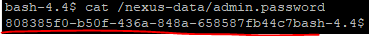

### 3. nexus  설정

#### 3.1 관리자 화면 확인 및 로그인

> ```
> http://기동한 서버도메인주소.nip.io/
> ```

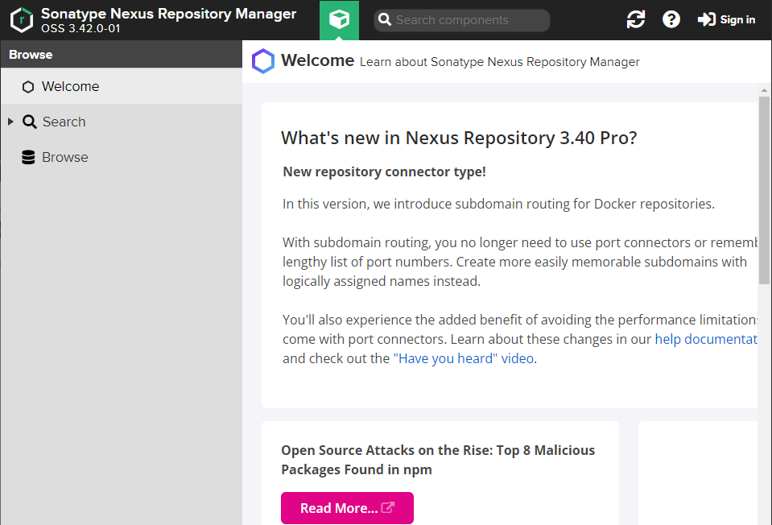


*****

#### 3.2 Nexus 에서 docker-hosed 와 docker-proxy Blob 생성

톱니바퀴 > Repository > Blob Stores > Create blob store
docker-hosted 와 docker-hub 2개 생성이 필요합니다.
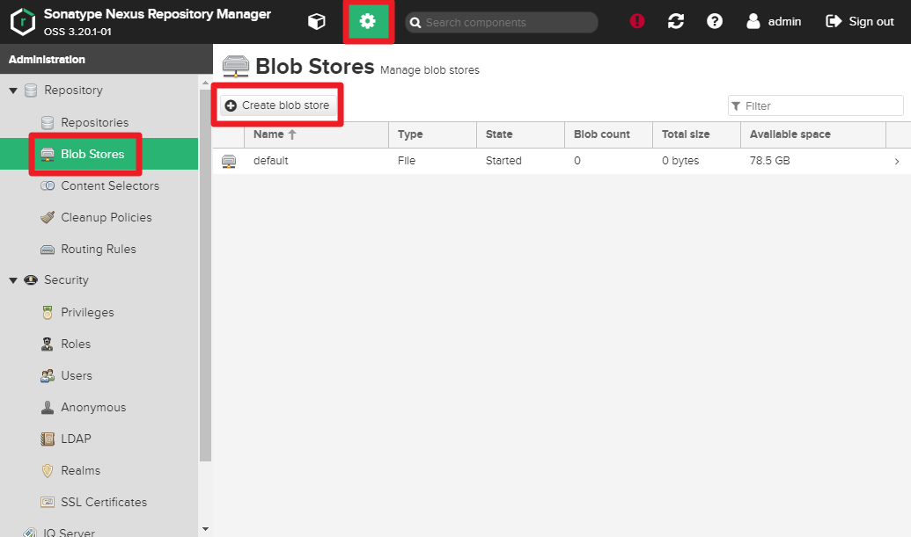

Name : docker-hosted
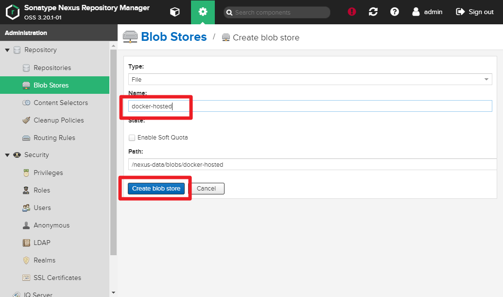

Name : docker-hub


---

#### 3.3 Nexus 에서 docker-hosed 와 docker-proxy 저장소 생성

톱니바퀴 > Repository > Repositories > Create repository
docker-hosted 와 docker-hub 2개 생성이 필요합니다.
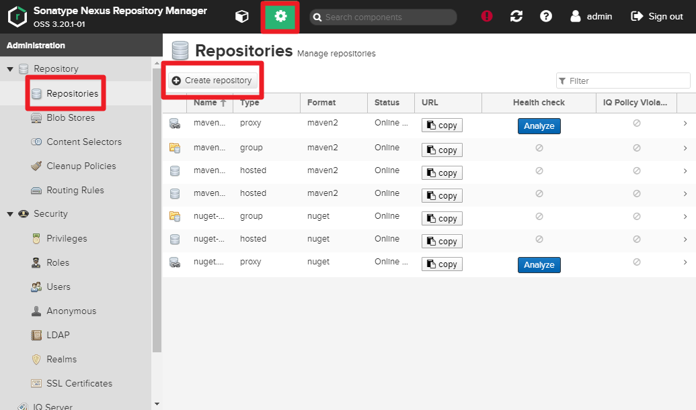
docker (hosted) 선택

- Name은 docker-hosted
- HTTP 영역 체크 및 5000 입력
- Enable Docker V1 API 체크
- Blob store docker-hosted 선택
  
  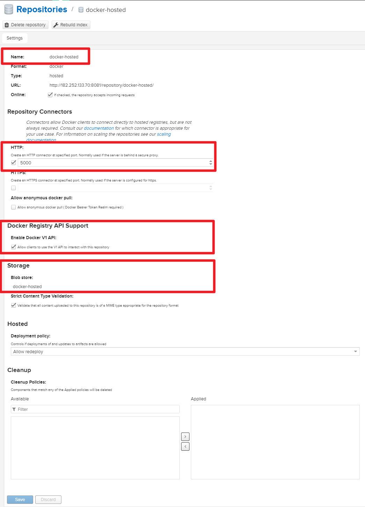

docker (proxy) 선택

- Name은 docker-hub
- Enable Docker V1 API 체크
- Remote storage 에 `https://registry-1.docker.io` 입력
- Use Docker Hub 선택
  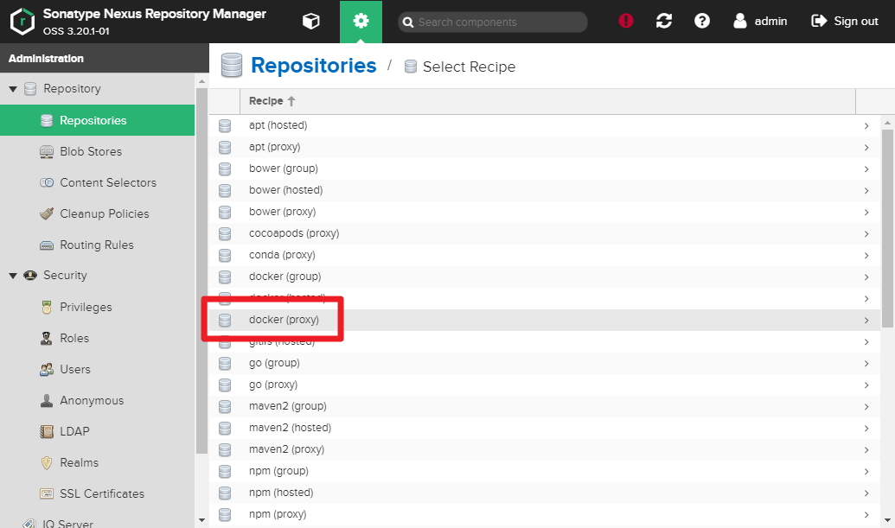
  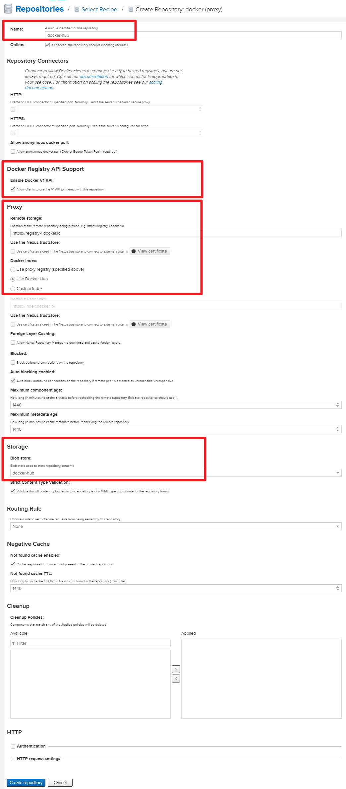


---


#### 3.4 Nexus 에서 Realms 설정

톱니바퀴 > Realms > `Docker Bearer Token Realm` Active로 이동 > Save
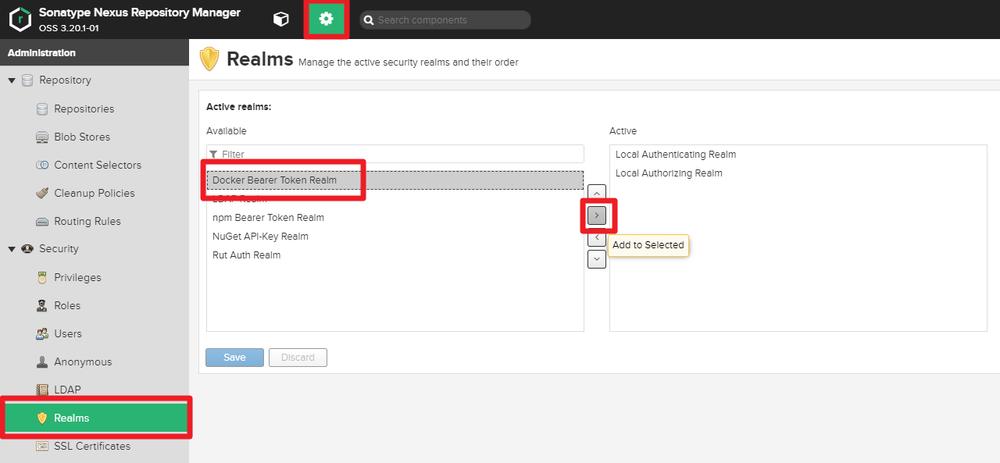
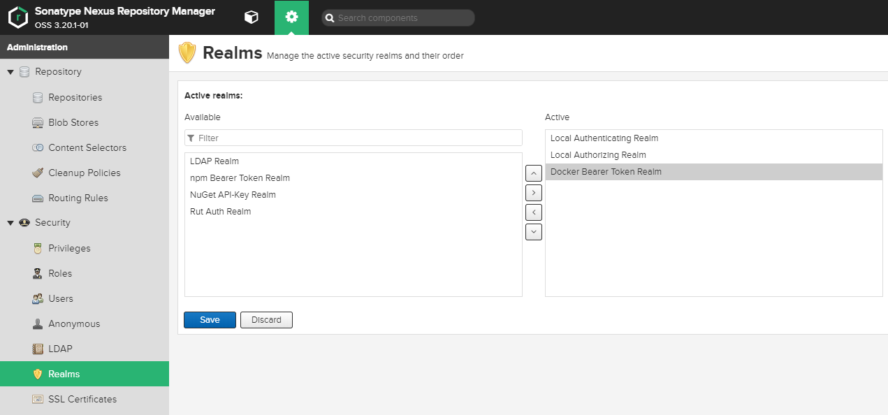


---


#### 3.5 nexus docker-hub ingress 추가 설정 파일 kubectl apply

```yaml
apiVersion: v1
kind: Service
metadata:
  name: nexus-repo
  namespace: nexus
  labels:
    app: nexus
spec:
  selector:
    app: nexus
  ports:
  - port: 5000
    targetPort: 5000
---
apiVersion: networking.k8s.io/v1
kind: Ingress
metadata:
  name: nexus-repo-ingress-bastion
spec:
  ingressClassName: traefik
  rules:
  - host: "nexus-repo.nexus.cloud.35.209.207.26.nip.io"
    http:
      paths:
      - path: /
        pathType: Prefix
        backend:
          service:
            name: nexus-repo
            port:
              number: 5000
```

```bash
$ kubectl apply -f nexus-repo.yaml -n nexus
```


---


### 4. Nexus Docker-hub 테스트

#### 4.1 docker 명령어 http 사용 가능 설정 (v1) -> 

docker insecure registry 추가
모든 워커노드에서 Nexus repository에 접근을 허용하기 위한 설정을 진행합니다. 공인 TLS 인증이 되지 않은 Private repository에 HTTP접근을 허용하기 위한 설정입니다. 도커를 설치 한 후 생성되는 /etc/.docker/damon.json에 다음과 같은 코드를 추가합니다(docker desktop에서는 dashboard를 통해 설정 할 수 있습니다).

`/etc/docker/daemon.json` 파일 생성
✔️ 기존에 존재하지 않는 파일이면, 새로 만들어야 합니다.

```bash
$ cat /etc/docker/daemon.json
{
        "insecure-registries" : ["182.252.133.70:5000"]
}
```

docker 데몬 재기동

```bash
$ service docker restart
```

nexus 컨테이너 재시작

```bash
$ docker restart nexus
```


---


#### 4.2 사내 Docker 저장소 로그인

```bash
$ docker login nexus-repo.nexus.cloud.35.209.207.26.nip.io
Username: admin
Password:
WARNING! Your password will be stored unencrypted in /root/.docker/config.json.
Configure a credential helper to remove this warning. See
https://docs.docker.com/engine/reference/commandline/login/#credentials-store

Login Succeeded
```


---


#### 4.3 외부 클라이언트에서 docker pull 그리고 사내 Docker 저장소에 push

```bash
$ ssh root@${MY_IP} # (LOCAL)

$ docker pull busybox:1.27 # hub.docker.com 에서 image pull

$ docker images -a #image 확인
REPOSITORY          TAG                 IMAGE ID            CREATED             SIZE
busybox             latest              6d5fcfe5ff17        5 weeks ago         1.22MB

$ docker tag busybox:1.27 nexus-repo.nexus.cloud.35.209.207.26.nip.io/busybox:1.27 #저장소 업로드를 위한 태깅

$ docker push nexus-repo.nexus.cloud.35.209.207.26.nip.io/busybox:1.27 #저장소 업로드
The push refers to repository [nexus-repo.nexus.cloud.35.209.207.26.nip.io/busybox]
195be5f8be1d: Pushed
v20200205: digest: sha256:edafc0a0fb057813850d1ba44014914ca02d671ae247107ca70c94db686e7de6 size: 527
```


---


#### 4.4 사내 저장소에 push된 이미지 확인

1) Nexus 웹으로 접속 [http://182.252.133.70:8081](http://182.252.133.70:8081/)

Browse > docker-hosted
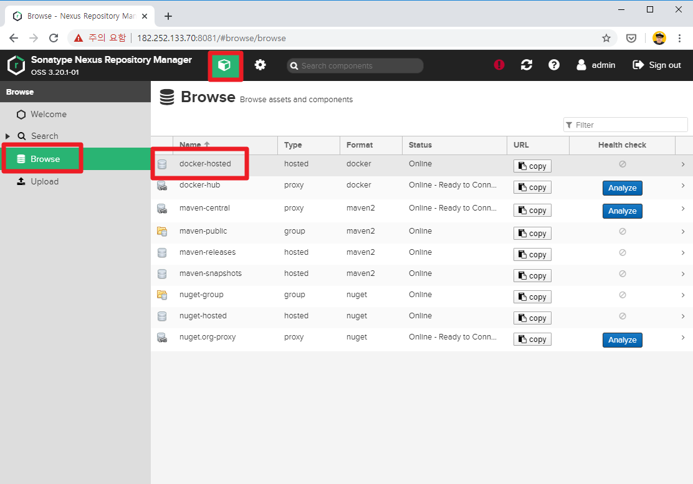

tag 확인
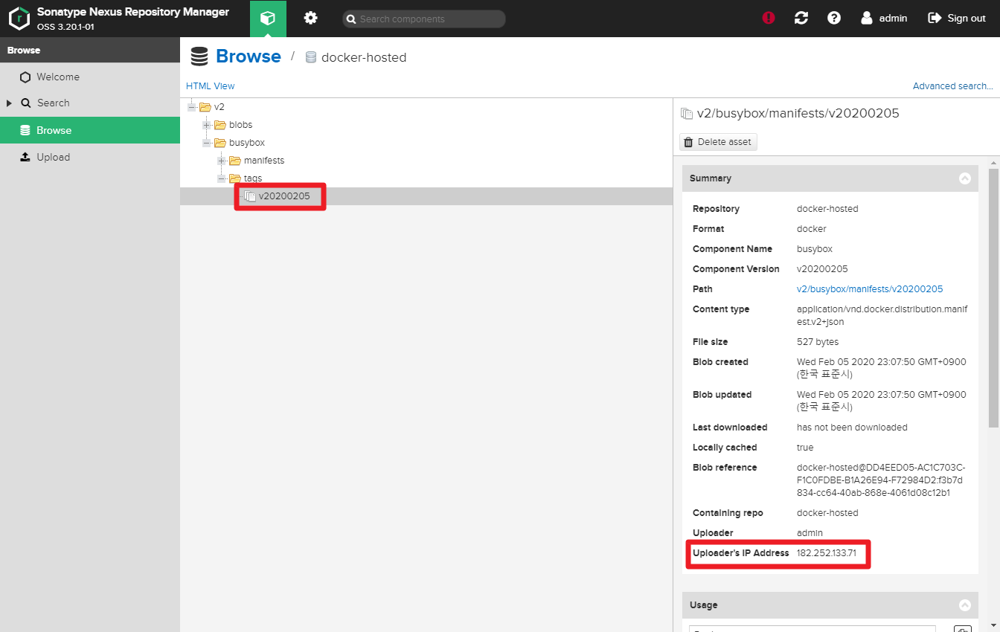

사내 저장소에서 pull 받기

```bash
$ docker pull nexus-repo.nexus.cloud.35.209.207.26.nip.io/busybox:1.27 
bdbbaa22dec6: Pull complete
Digest: sha256:edafc0a0fb057813850d1ba44014914ca02d671ae247107ca70c94db686e7de6
Status: Downloaded newer image for nexus-repo.nexus.cloud.35.209.207.26.nip.io/busybox:1.27
nexus-repo.nexus.cloud.35.209.207.26.nip.io/busybox:1.27

$ docker images -a
REPOSITORY                    TAG                 IMAGE ID            CREATED             SIZE
182.252.133.70:5000/busybox   v20200205           6d5fcfe5ff17        5 weeks ago         1.22MB
```


---


#### 4.5  Kubernets 파드 배포를 위해 Nexus에서 docker 이미지 받아오기 설정

1. K8S private repository를 사용하기 위해서는 Secret을 생성해 Nexsus 환경 변수를 설정해야 합니다.docker login을 통해 저장된 정보로 시크릿을 생성하거나 다음과 같이 CLI을 통해 시크릿을 생성합니다.

```bash
kubectl create secret docker-registry nexus-secret -n nexus \
--docker-server=nexus-repo.nexus.cloud.35.209.207.26.nip.io \
--docker-username=admin \
--docker-password=new1234!

#docker-registry secret 을 default seriveAccount에 매핑
$ kubectl patch serviceaccount default -p '{"imagePullSecrets": [{"name": "nexus-secret"}]}' -n nexus
```


---


#### 4.6  kubectl 배포 테스트

```yaml
apiVersion: apps/v1
kind: Deployment
metadata:
  name: test
  namespace: nexus
spec:
  replicas: 1
  selector:
    matchLabels:
      app: test
  template:
    metadata:
      labels:
        app: test
    spec:
      imagePullSecrets:
      - name: nexus-secret
      containers:
      - name: nexus
        image: nexus-repo.nexus.cloud.35.209.207.26.nip.io/busybox-test:1.27
```

```bash
$ kubectl apply -f test.yaml -n nexus
$ kubectl get pod -n nexus

NAME                    READY   STATUS             RESTARTS      AGE
test-5f8d87c5d9-w7rmd   0/1     ImagePullBackOff   0             4m50s
```

---


#### 4.7 참고사항

(insecure registry 설정이 안되어있을경우 아래와 같이 설정 후 테스트)


---


**참고1**(local 및 docker를 container runtime으로 사용하고있는경우 경우)

Linux 계열

```bash
$ vi /etc/docker/daemon.json
{ "insecure-registries" : ["http://nexus-repo.nexus.cloud.35.209.207.26.nip.io"] }
```

Windows 계열

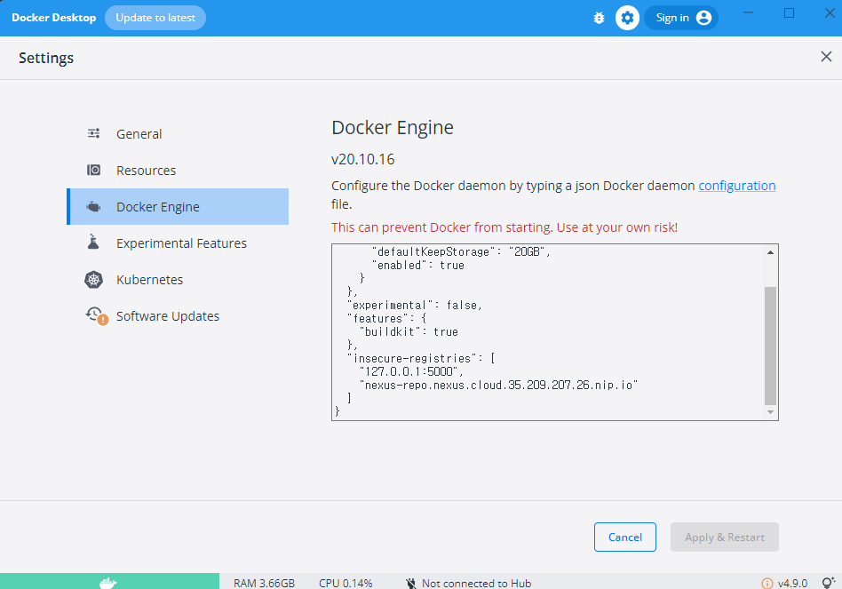


---


**참고2**

podman 을 사용중인경우

```bash
cat > /etc/containers/registries.conf.d/myregistry.conf <<EOF

[[registry]]
location = "registry.myexample.kr"
insecure = true

EOF
```

---


**참고3**(k3s를 사용중인경우-default 로 rancher 로 세팅된다.)

k3s 서버나 k3s-agent 모두 동일하게 /etc/rancher/k3s/registries.yaml 파일 및 내용을 추가한후 서비스

```bash
#Worker Node ssh 접속 후
$ vi /etc/rancher/k3s/registries.yaml
mirrors:
  "nexus-repo.nexus.cloud.35.209.207.26.nip.io":
    endpoint:
      - "http://nexus-repo.nexus.cloud.35.209.207.26.nip.io"
configs:
  "nexus-repo.nexus.cloud.35.209.207.26.nip.io":
    auth:
      username: admin
      password: new1234!
```


k3s 재기동

```bash
$ systemctl restart k3s 
#또는 
#$ systemctl restart k3s-agent
```


아래와같이 확인가능

```bash
$ crictl info | jq -r '.config.registry'
{
  "mirrors": {
    "nexus-repo.nexus.cloud.35.209.207.26.nip.io": {
      "endpoint": [
        "http://nexus-repo.nexus.cloud.35.209.207.26.nip.io"
      ],
      "rewrite": null
    },
    "docker.io": {
      "endpoint": [
        "https://registry-1.docker.io"
      ],
      "rewrite": null
    }
  },
  "configs": {
    "nexus-repo.nexus.cloud.35.209.207.26.nip.io": {
      "auth": {
        "username": "jacobbaek",
        "password": "jacobbaek_password",
        "auth": "",
        "identitytoken": ""
      },
      "tls": null
    }
  },
  "auths": null,
  "headers": null
}
```

